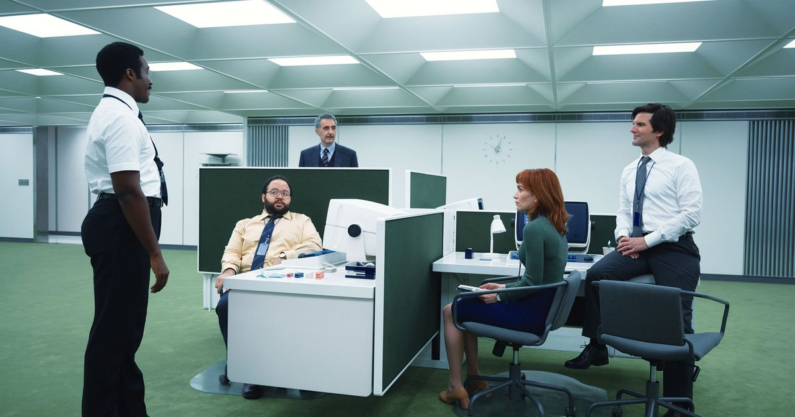

```{r, include = F}
library(ggeffects)
library(ggpubr)
library(lme4)
library(lmerTest)
library(sjPlot)
library(tidyverse)
library(viridis)
```

```{r setup, include = F}
knitr::opts_chunk$set(fig.align="center", include = F)
```

# Introduction
 
## About me

\pause

Massimiliano __"Max"__ Canzi

\pause \small

\begin{itemize}[<+->]
\item Lab Manager / Data Scientist @ Uni Konstanz
\item PhD in Linguistics @ Uni of Manchester 
\item MSc Forensic Speech Science @ Uni of York
\item MA Linguistics @ Uni of Manchester 
\end{itemize}

## About me

\pause \normalsize

Interested in: __R__, experimental designs, __reproducibility__, open science, improving existing methodologies, data visualisation, honest scientific communication...
 
## About the LingLabs

\pause

Consortium of linguistic laboratories at the University of Konstanz spanning a variety of research topics and fields. 

\pause \small

\begin{itemize}[<+->]
\item \textbf{Digital Signal Processing in R} by Dr Cristopher Carignan (UCL). \textit{8th and 9th of June, 2-4 pm CEST}
\item \textbf{Collecting and exploring social media data in R} by Dr Lisa Donlan (UoManchester). \textit{ß22nd and 23rd of Sept, 2-4 pm CEST}
\item ...
\end{itemize}

\pause https://www.ling.uni-konstanz.de/forschung/workshops/

## Motion Pictures / Scientific Experiments

\normalsize

\pause 

Planning a (linguistics) experiment and a movie production are not as far apart as you would think...

\pause \small

\begin{itemize}[<+->]
\item Write a script
\item Set a production budget 
\item Casting, locations, props, storyboards
\item Shoot the film
\item Editing, colour grading, VFX
\item Press, festivals
\end{itemize}

## Motion Pictures / Scientific Experiments



##  Motion Pictures / Scientific Experiments

\pause \normalsize

Planning a (linguistics) experiment and a movie production are not as far apart as you would think...

\pause \small

\begin{itemize}[<+->]
\item Formulate a research question
\item Budget, weigh methodologies, availability of participants and tools
\item Recruitment, equipment setup, hardware and software
\item Data collection
\item Data wrangling, analaysis and visualisation
\item Papers, conferences
\end{itemize}

## Motion Pictures / Scientific Experiments

\pause \normalsize

Just like when shooting a film, __plan ahead__. \pause

The more things you can accurately predict and plan, the more solid your design and experiment will be. __That's pretty much all there is to it__.

## Thank you! 

__Questions?__

## Thank you! 

\pause \normalsize

__Just kidding...__ let's get started.

# Pre-Production

## The Script

\pause \small

Find a direct, achievable link between the __theory__ and its __implementation__. 

\pause

If your research question is too complex __scale down__, __zoom in__. 

\pause 

Develop clear, __testable__ hypotheses. 

## The Budgeting

\pause

Find a direct, achievable link between the __theory__ and its __implementation__. 

\pause \small

\begin{itemize}[<+->]
\item What \textbf{method} is best to answer the question? 
\item How many experiments? 
\item What experimental \textbf{design}?
\item How (and what) are variables going to be coded?
\end{itemize}

## The Genre (aka The Method)

\pause Choose a method that __fits your research question__, but keep __ease of implementation__ in mind. 

\pause __Know your method well!__ Methods comes with __baggage__, meaning that often the chosen method determines conventions in experimental design, data analysis, presentation of results, etc. 

\pause Don't be afraid to innovate.

## Film or Mini Series?

\pause Multiple experiments _might_ allow for a less complex experimental design, follow-up studies, ...

\pause However, more experiments also mean more time spent on participant recruitment, data collection, ...

## Camera and Lens

\pause \small __If you were to take one thing home from today, make it this one:__ 

\pause __>>__ less is more __<<__

\pause Every time you add a categorical predictor with two levels, for example, you should double your data. __Can you afford it?__

\pause Use tools like `simr` to help you determine sample size (Green and MacLeod 2016).

\pause For the now visibly upset Bayesians...

## Camera and Lens 

\pause Choosing an experimental method and design is equivalent to choosing the __resolution__ of your study.

\pause It is, again, really important that your design allows you to confidently test your hypotheses as you intend to. 

\pause \small

\begin{itemize}[<+->]
\item Know your \textbf{limits}
\item Know your \textbf{goals}
\item Choose a balanced design
\item \textbf{Register your report?}
\end{itemize}

## Registered Reports

- Mertzen, D., Lago, S., & Vasishth, S. (2021). The benefits of preregistration for hypothesis-driven bilingualism research. Bilingualism: Language and Cognition, 24(5), 807-812.
- Roettger, T. B. (2021). Preregistration in experimental linguistics: Applications, challenges, and limitations. Linguistics, 59(5), 1227-1249.

## Resoution

\pause One mistake I see often is related to variable coding, for example..

\pause \small

\begin{itemize}[<+->]
\item Binary instead of continuous.. 
\item 5-point instead of 100-point scales
\item 100-point scales instead of 5-point scales
\item ...
\end{itemize}

# Production

## Find a Balance

\pause

Things to consider: 

\pause \small

\begin{itemize}[<+->]
\item Location of the experiment (e.g. lab, online)
\item Number of items
\item Number of participants
\item What sample?
\item ...
\end{itemize}

## Filming Locations

\pause Don't underestimate the power of the internet. 

\pause Social medias, esp. __Twitter__, are a great place to advertise for your online studies. 

\pause Online platforms are getting better and better, allowing for more complex designs and data collection types (e.g. reaction times, Stoet 2017).

## Scenes

\pause A balance between number of items and participants is necessary, and often dictated by the methodology \pause e.g. ERP experiments. 

\pause Ideally, you would have an infinite number of both.

\pause Always ask your participants a little more, especially if it's a lab-based experiment. 

## Casting

\pause Are university students in your university represnatitve enough of the sample you're looking for? 

## Bits and Pieces

\pause 

\begin{itemize}[<+->]
\item Write everything down (hardware, software, locations, etc.)
\item Get all the forms you need (participant consent, data protection)
\item Plan a storage solution for data and anonymise whenever possible 
\item Hire a research assistant
\end{itemize}

# Post-Production

## Editing

__Know your data!__

## Editing

Let's have a look at some R code

```{r, include = F, eval = T}
fm <- read_csv("../data/facemask.csv") %>% 
  filter(correct == TRUE) %>%
  select(participant_private_id, participant_device_type, item, fricative, condition, rt) %>%
  mutate_if(is.character, as.factor)
```

```{r, include = F, eval = T}
head(fm)
```

```{r, include = F, eval = T}
rt_log <- fm %>% mutate(rt = log(rt))
```

```{r, eval = F, include = T}
model_one <- rt_log %>% lmer(formula = rt ~ condition * fricative + participant_device_type + (condition | participant_private_id) + (1 | item))
```

```{r, include = F, eval = F}
model_two <- fm %>% 
  #filter(rt >= median(rt) - 3 * mad(rt) & rt <= median(rt) + 3 * mad(rt)) %>%
    glmer(formula = rt ~ condition * fricative + participant_device_type + (1 | participant_private_id) + (1 | item), 
                          family = Gamma(link = "log"), 
                          control = glmerControl(optimizer = "bobyqa"))
```

```{r, eval = T, include = F}
model_one <- rt_log %>% 
  filter(rt >= median(rt) - 3 * mad(rt) & rt <= median(rt) + 3 * mad(rt)) %>%
  lmer(formula = rt ~ condition * fricative + participant_device_type + (condition | participant_private_id) + (1 | item))
```

```{r, include = F, eval = F}
model_two <- fm %>% 
  filter(rt >= median(rt) - 3 * mad(rt) & rt <= median(rt) + 3 * mad(rt)) %>%
    glmer(formula = rt ~ condition * fricative + participant_device_type + (1 | participant_private_id) + (1 | item), 
                          family = Gamma(link = "log"), 
                          control = glmerControl(optimizer = "bobyqa"))
```

```{r, include = F, eval = F}
car::Anova(model_one, type = "III")
car::Anova(model_two, type = "III")
```

```{r, include = F, eval = F}
ggarrange(plot_model(model_one, type = "pred", terms = c("fricative", "condition")),
          plot_model(model_two, type = "pred", terms = c("fricative", "condition")),
          common.legend = TRUE) -> arranged_plot
```

```{r, include = F, eval = F, width = "50%"}
arranged_plot
```

## Editing

\pause

Welcome back!

\pause

Some references: 

- Baayen, R. H., & Milin, P. (2010). Analyzing reaction times. International Journal of Psychological Research, 3(2), 12-28.
- Leys, C., Ley, C., Klein, O., Bernard, P., & Licata, L. (2013). Detecting outliers: Do not use standard deviation around the mean, use absolute deviation around the median. Journal of experimental social psychology, 49(4), 764-766.

## Editing

\pause When modelling: 

\begin{itemize}[<+->]
\item Your most complex model should be clear to you before you even start collecting data. 
\item What is a fixed effect and what is a random effect in your experiment? 
\item Slopes galore
\end{itemize}

## Editing

\pause

Sometimes, it's not as straightforward \pause i.e. the story of event-related potentials (ERP)

## Editing

\pause Reporting your results:

\pause

\begin{itemize}[<+->]
\item Standardise (e.g. APA)
\item Provide supporting material
\item package \texttt{report}
\end{itemize}

## Editing

\footnotesize

We fitted a linear mixed model (estimated using REML and nloptwrap optimizer) to predict rt with condition, fricative and participant_device_type (formula: rt ~ condition * fricative + participant_device_type). The model included condition, participant_private_id and item as random effects (formula: list(~condition | participant_private_id, ~1 | item)). The model's total explanatory power is substantial (conditional R2 = 0.41) and the part related to the fixed effects alone (marginal R2) is of 0.08. The model's intercept, corresponding to condition = NM, fricative = FF and participant_device_type = computer, is at 6.89 (95% CI [6.81, 6.97], t(11044) = 171.01, p < .001). Within this model:

  - The effect of condition [WM] is statistically non-significant and positive (beta = 4.10e-03, 95% CI [-0.04, 0.05], t(11044) = 0.17, p = 0.867; Std. beta = 7.57e-03, 95% CI [-0.08, 0.10])
  - The effect of fricative [SH] is statistically significant and negative (beta = -0.22, 95% CI [-0.30, -0.15], t(11044) = -5.52, p < .001; Std. beta = -0.41, 95% CI [-0.56, -0.27]) ...

## Editing

\footnotesize

Analyses were conducted using the R Statistical language (version 4.0.3; R Core Team, 2020) on macOS Big Sur 10.16, using the packages ggpubr (version 0.4.0; Alboukadel Kassambara, 2020), Matrix (version 1.3.2; Douglas Bates and Martin Maechler, 2021), lme4 (version 1.1.26; Douglas Bates et al., 2015), ggplot2 (version 3.3.5; Wickham. ggplot2: Elegant Graphics for Data Analysis. Springer-Verlag New York, 2016.), stringr (version 1.4.0; Hadley Wickham, 2019), tidyr (version 1.1.2; Hadley Wickham, 2020), forcats (version 0.5.1; Hadley Wickham, 2021), readr (version 1.4.0; Hadley Wickham and Jim Hester, 2020), dplyr (version 1.0.4; Hadley Wickham et al., 2021), tibble (version 3.1.5; Kirill Müller and Hadley Wickham, 2021), lmerTest (version 3.1.3; Kuznetsova A et al., 2017), purrr (version 0.3.4; Lionel Henry and Hadley Wickham, 2020), sjPlot (version 2.8.9; Lüdecke D, 2021), viridis (version 0.5.1; Simon Garnier, 2018), viridisLite (version 0.4.0; Simon Garnier et al., 2021) and tidyverse (version 1.3.0; Wickham et al., 2019).

## Color Grading

\pause


## Color Grading

\pause When modelling, I like to provide plots showing model estimates, rather than plotting raw data. 

\pause For example, you can use package \texttt{sjPlot}, or do it yourself with packages \texttt{ggeffects} and \texttt{ggplot2}.

```{r, include = F}
ggpredict(model_one, terms = c("fricative", "condition")) -> pred
```

```{r, include = F}
pred %>% 
  ggplot(aes(y = predicted, x = x, col = group))

```

```{r, include = F}
library(palmerpenguins)
```

```{r, include = F}
penguin.model <- penguins %>% 
  lmer(formula = body_mass_g ~ flipper_length_mm * species + (1 | year))
```

```{r, include = F}
summary(penguin.model)
```

```{r, include = F}
penguin.pred <- ggpredict(penguin.model, terms = c("flipper_length_mm", "species"))
```

```{r, include = F, message = F}
plot_model(penguin.model, type = "pred", terms = c("flipper_length_mm", "species")) +
  aes(linetype = group) 
  #scale_colour_manual(values = c()) + 
  #scale_fill_manual(values = c())
```

## Color Grading

Again, __>>__ less is more __<<__. A few tips: 

\pause

\begin{itemize}[<+->]
\item Use package \texttt{viridis} whenever possible -- https://cran.r-project.org/web/packages/viridis/vignettes/intro-to-viridis.html
\item Differentiate with shape, not just with colour
\item Label everything clearly
\item \textbf{Don't cheat!}
\item Check with journals
\end{itemize}

## Festivals

\pause Experiment done, data analysed, results reported, paper written. Time to __get it out into the world__. 

\pause Consider __Open Access__ whenever possible. 

\pause Share your data and your code with your paper. 

## Ending Credits 

\footnotesize

- Baayen, R. H., & Milin, P. (2010). Analyzing reaction times. International Journal of Psychological Research, 3(2), 12-28.
- Green, P., & MacLeod, C. J. (2016). SIMR: an R package for power analysis of generalized linear mixed models by simulation. Methods in Ecology and Evolution, 7(4), 493-498.
- Leys, C., Ley, C., Klein, O., Bernard, P., & Licata, L. (2013). Detecting outliers: Do not use standard deviation around the mean, use absolute deviation around the median. Journal of experimental social psychology, 49(4), 764-766.
- Stoet, G. (2017). PsyToolkit: A novel web-based method for running online questionnaires and reaction-time experiments. Teaching of Psychology, 44(1), 24-31.
